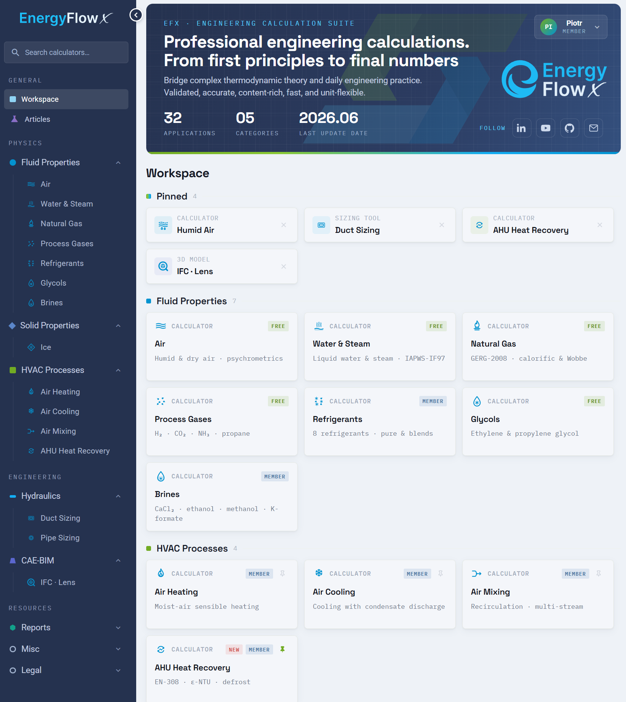
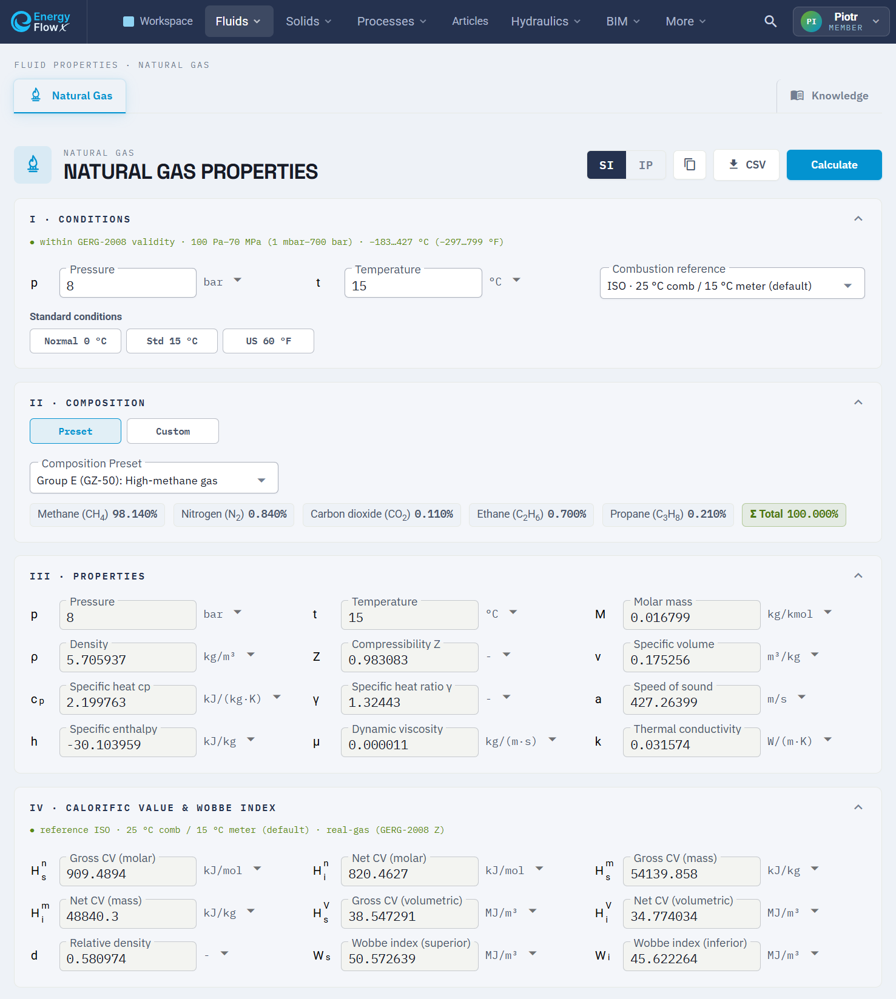
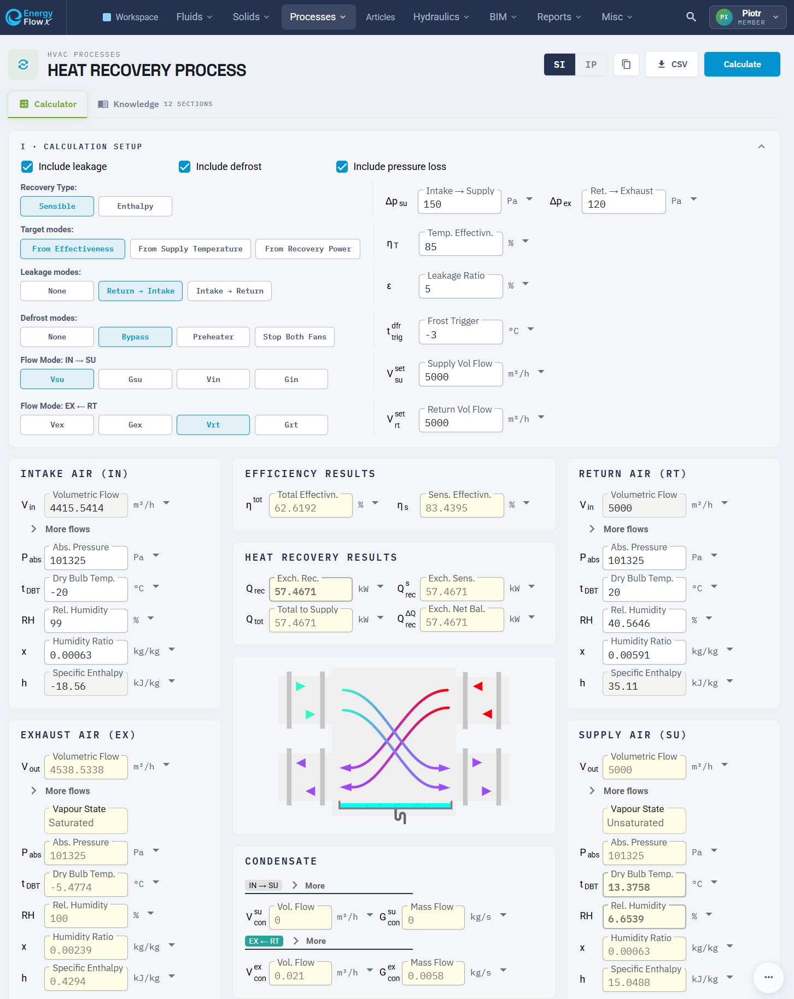
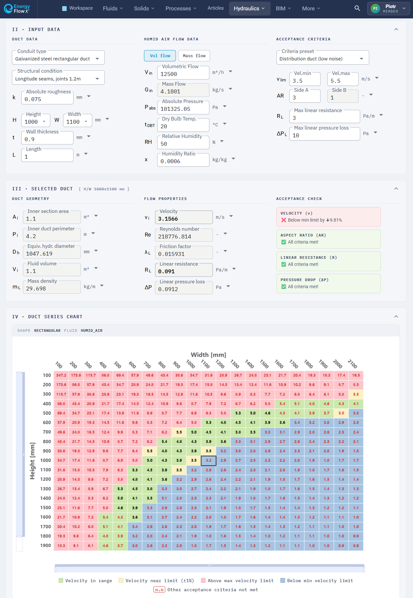
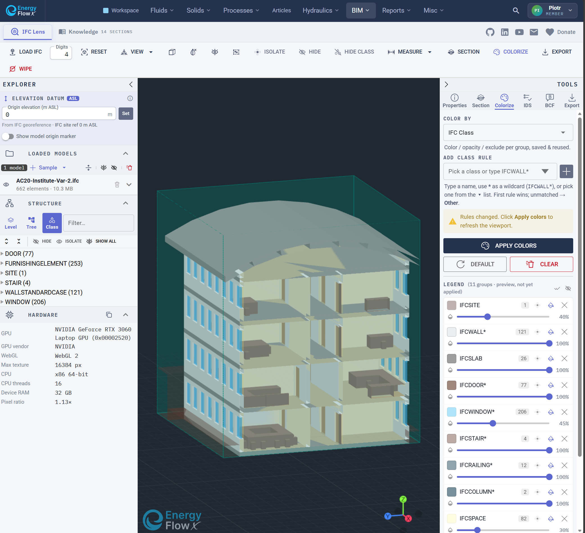
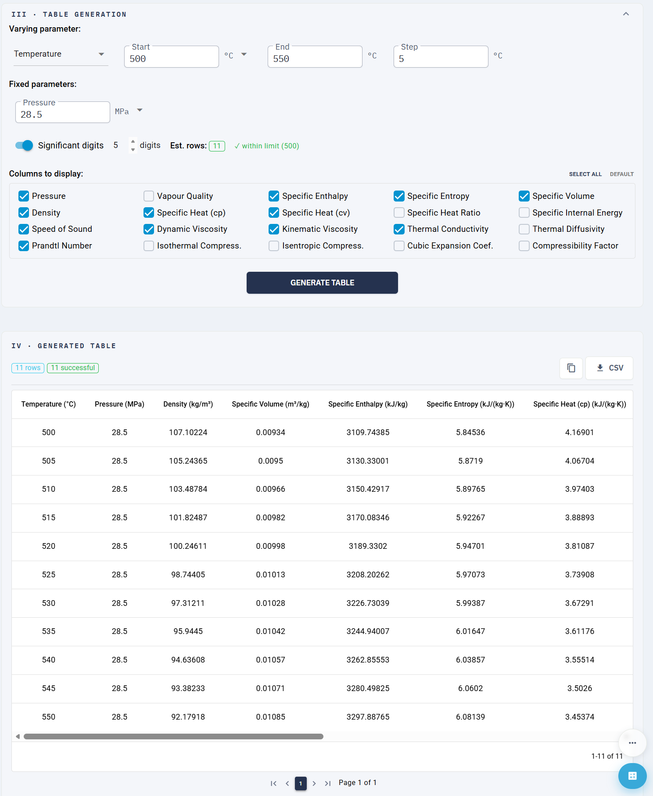
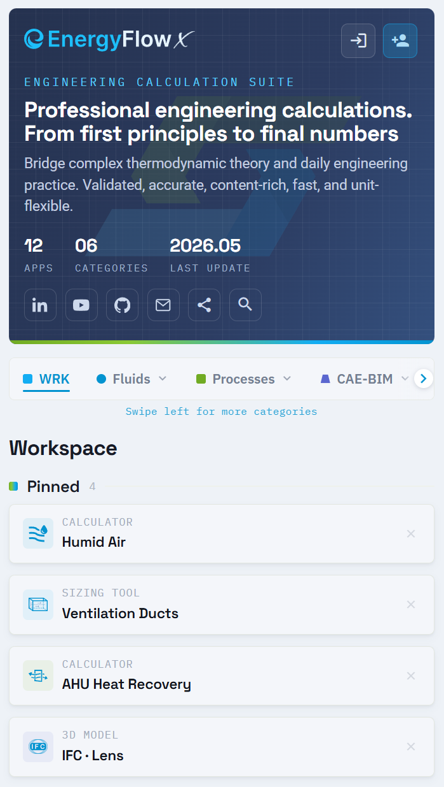
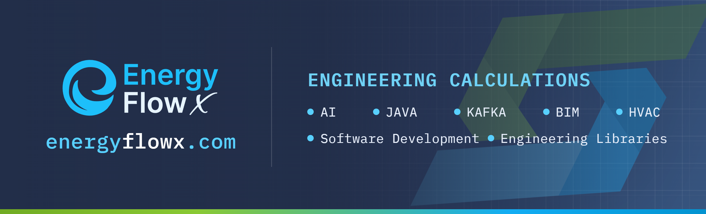

# ENERGY FLOW X (EFX): Engineering Calculation Suite

[](https://energyflowx.com)

> **Professional engineering calculations. From first principles to final numbers.**
> Bridge complex thermodynamic theory and daily engineering practice. Validated, accurate, content-rich, fast, and unit-flexible.

**EnergyFlowX** is a professional-grade web platform for thermophysical property analysis, HVAC process design, and fluid mechanics. It is built for HVAC/MEP engineers, mechanical engineers, and chemical/process engineers who need precise, standards-based numbers and would rather not assume that specific heat is a constant.

| | |
|---|---|
| **Applications** | 32 |
| **Categories** | 5 |
| **Last update** | 2026.06 |
| **Website** | [energyflowx.com](https://energyflowx.com) |

[](https://energyflowx.com)

This is not "_just another psychrometrics calculator_". It is a comprehensive engineering software ecosystem, powered by a family of scientific libraries written from scratch, the result of years of development and well over 10,000 hours of personal time. The browser interface you see is merely the crowning jewel, the cherry on top of a very deep cake.

To readers unfamiliar with fluid mechanics and thermodynamics, the calculation forms may look deceptively simple. Trust me, there is nothing simple here once you look behind the curtain.

**No fluid parameter is treated as a constant.** Density, specific heat, viscosity, conductivity, every temperature- and pressure-dependent property is computed from first-principles equations sourced from international standards (IAPWS, ISO, EN, ASHRAE), peer-reviewed literature, or formulations derived independently. The full reference list lives at the end of this document.

[](https://energyflowx.com)

---

# TABLE OF CONTENTS

1. [The mission](#1-the-mission)
2. [Why engineers use EFX](#2-why-engineers-use-efx)
3. [Fluids we support](#3-fluids-we-support)
4. [HVAC processes](#4-hvac-processes)
5. [Hydraulics, duct and pipe sizing](#5-hydraulics-duct-and-pipe-sizing)
6. [CAE-BIM, the IFC Lens](#6-cae-bim-the-ifc-lens)
7. [Property tables and data tools](#7-property-tables-and-data-tools)
8. [Knowledge, the documentation engineers actually read](#8-knowledge-the-documentation-engineers-actually-read)
9. [Units and flexibility](#9-units-and-flexibility)
10. [Designed for mobile, friendly for wide](#10-designed-for-mobile-friendly-for-wide)
11. [The engine room, dedicated libraries](#11-the-engine-room-dedicated-libraries)
12. [Engineering practices and numerical methods](#12-engineering-practices-and-numerical-methods)
13. [Architecture and technology](#13-architecture-and-technology)
14. [Security and privacy](#14-security-and-privacy)
15. [Access tiers](#15-access-tiers)
16. [The numbers are computed, not generated](#16-the-numbers-are-computed-not-generated)
17. [Licensing, citation, and attribution](#17-licensing-citation-and-attribution)
18. [Feedback and bug reporting](#18-feedback-and-bug-reporting)
19. [Acknowledgments](#19-acknowledgments)
20. [Reference sources](#20-reference-sources)

---

## 1. THE MISSION

**Liberate engineering calculations.**

Every law of physics was won by brilliant minds who dedicated their lives to chasing the truth, and that knowledge belongs to all of us. It is one of the most precious foundations of our civilisation. Yet the software built on it often sits locked behind licenses that bleed engineers of hundreds to thousands every year, quietly devouring the net margins of the very firms that keep the world running.

Not anymore. Engineers, a heavy cavalry is riding to your aid. Brace, or join the charge.

- **Free to use.** Some tools stay free for good, others are free for testing, and which is which may change over time. Heavy use may be rate limited. In return, please credit and cite the work, share it, and report bugs.
- **Honestly affordable.** A few advanced applications may be paid in the future, or offer limited free access, and some require an active account for testing. Any future pricing will be elastic, affordable, and friendly.

Breaking a monopoly takes a movement. Your trust, your feedback, and spreading the word are what keep calculations free. Use the tools, and tell another engineer.

> _Amicus Plato, sed magis amica veritas._

---

## 2. WHY ENGINEERS USE EFX

EnergyFlowX is built around six promises, and every calculator in the suite is held to them.

- **Validated accuracy.** Results are validated against IAPWS reference formulations, Lemmon et al. Helmholtz-EOS correlations for air, and official property tables using systematic benchmarking. Where applicable, implementations are cross-checked against international standard formulations and published reference data.
- **Fast numerical methods.** Built on robust iterative solvers, including modified Brent-Dekker and Newton-Raphson methods, tuned for convergence stability and computational efficiency.
- **Well tested.** Verified through unit, integration, and regression testing, with independent cross-validation by other engineers wherever possible.
- **Flexible units.** Full SI and Imperial support with consistent internal dimensional handling across every calculation.
- **Independently developed.** Built strictly on science and engineering best practice, with no industrial or commercial influence pulling the numbers.
- **Actively maintained.** Continuously refined, with ongoing improvements, validation updates, and performance work driven by new findings and your feedback.

Each result also ships with a built-in **validation report**, a benchmark of the engine output against reference data, so you can see the agreement instead of taking it on faith.

---

## 3. FLUIDS WE SUPPORT

EnergyFlowX models **23 fluids across 7 engineering groups**, plus solid-phase ice. Each one returns a full thermodynamic and transport property set, with no constant-property shortcuts. The chemistry is real, the equations of state are reference-grade, and the validity ranges are stated openly.

[](https://energyflowx.com/fluid-properties/natural-gas/natural-gas)

### Air

| Fluid | Model | Validity | Access |
|---|---|---|---|
| Humid Air | Humid-air mixture model (IAPWS-IF97 water side, Lemmon dry-air EOS, G11-15 virial closure) | −80 to 200 °C, 10 Pa to 5 MPa | Free |
| Dry Air | Lemmon Helmholtz EOS | wide range | Free |

Humid air covers vapour saturation pressure, dew point and wet bulb temperatures, relative humidity, humidity ratio and maximum humidity ratio, specific enthalpy (including water-mist and ice-mist components), density, specific heat, viscosity, thermal conductivity, thermal diffusivity, and Prandtl number, with enhanced fugacity per IAPWS G11-15.

### Water and Steam

| Fluid | Model | Coverage | Access |
|---|---|---|---|
| Water (liquid) | IAPWS-IF97, R12-08, R15-11 | Region 1 plus transport properties | Free |
| Steam | IAPWS-IF97 | Full Regions 1 to 5, backward equations p(h,s), v(p,T) | Free |

Density, enthalpy, entropy, specific heat (Cp, Cv), speed of sound, isothermal compressibility, thermal expansion, viscosity, thermal conductivity, and surface tension, across compressed liquid, superheated vapour, near-critical, two-phase, and high-pressure regions.

### Natural Gas `NEW`

| Fluid | Model | Output | Access |
|---|---|---|---|
| Natural Gas | GERG-2008 (ISO 20765-2), ISO 6976 | Density, compressibility Z, heat capacities, speed of sound, calorific value, Wobbe index | Free |

A multi-fluid Helmholtz equation of state for mixtures of up to 21 components, with composition presets or a fully custom blend.

### Process Gases `NEW`

| Fluid | Formula | Model | Validity | Access |
|---|---|---|---|---|
| Hydrogen | H₂ | Helmholtz EOS | −259 to 727 °C, ≤ 100 MPa | Free |
| Carbon Dioxide | CO₂ (R-744) | Span-Wagner EOS | −57 to 827 °C, ≤ 200 MPa | Free |
| Ammonia | NH₃ (R-717) | Helmholtz EOS | −78 to 407 °C, ≤ 50 MPa | Free |
| Propane | C₃H₈ (R-290) | Helmholtz EOS | −188 to 352 °C, ≤ 100 MPa | Free |

### Refrigerants `NEW`

Eight working fluids, pure and blended, identified by standardised R-numbers, with ISO 817 safety classification surfaced alongside the physics.

| Fluid | Composition | Model | Access |
|---|---|---|---|
| R-134a | C₂H₂F₄ | Helmholtz EOS | Member |
| R-1234ze(E) | C₃H₂F₄ | Helmholtz EOS | Member |
| R-1234yf | C₃H₂F₄ | Helmholtz EOS | Member |
| R-32 | CH₂F₂ | Helmholtz EOS | Member |
| R-125 | C₂HF₅ | Helmholtz EOS | Member |
| R-410A | R-32 / R-125 | Multi-fluid Helmholtz (blend) | Member |
| R-407C | R-32 / R-125 / R-134a | Multi-fluid Helmholtz (blend) | Member |
| R-454B | R-32 / R-1234yf | Multi-fluid Helmholtz (blend) | Member |

### Glycols `NEW`

| Fluid | Model | Validity | Access |
|---|---|---|---|
| Ethylene Glycol | Aqueous-solution model | freezing point to 100 °C, 0 to 60 % mass | Free |
| Propylene Glycol | Aqueous-solution model | freezing point to 100 °C, 0 to 60 % mass | Free |

### Brines `NEW`

| Fluid | Model | Validity | Access |
|---|---|---|---|
| Calcium Chloride Brine | Aqueous-solution model | freezing point to 40 °C, 0 to 30 % mass | Member |
| Ethanol Brine | Aqueous-solution model | freezing point to 40 °C, 0 to 60 % mass | Member |
| Methanol Brine | Aqueous-solution model | freezing point to 40 °C, 0 to 60 % mass | Member |
| Potassium Formate Brine | Aqueous-solution model | freezing point to 40 °C, 0 to 48 % mass | Member |

Concentration-dependent freezing-point limits are built in, so the model knows where the fluid actually stops being a liquid.

### Solid Properties

| Material | Model | Coverage | Access |
|---|---|---|---|
| Ice (Ice Ih) | Gibbs energy EOS, IAPWS R10-06 | Density, enthalpy, entropy, heat capacity, compressibility, thermal expansion, melting and sublimation curves | Free |

---

## 4. HVAC PROCESSES

Beyond raw properties, EnergyFlowX computes the processes engineers actually design around. Every process uses real humid-air thermodynamics, not constant-property approximations, and reports the full state of every air stream involved.

[](https://energyflowx.com/hvac-processes/heat-recovery)

**Air Heating.** Solve for a given input power, a target outlet temperature, or a target outlet relative humidity.

**Air Cooling with condensate discharge.** The same three solving modes, plus an optional coolant secondary-side calculation, with condensate tracked through the energy balance the way a real coil behaves.

**Air Mixing.** Two-stream mixing with full humidity content, or multi-stream recirculation mixing of up to 20 air streams in a single pass.

**AHU Heat Recovery `NEW`.** A serious heat-recovery engine built to EN 308, using the ε-NTU method. Solve from a given effectiveness, for a target supply temperature, or for a target recovered power. It supports sensible, latent, enthalpic, and total recovery, air-to-air and air-to-water configurations, frost and defrost diagnostics, and condensate tracking, with the capacity-rate asymmetry correction that separates a textbook answer from a usable one.

These processes can be reasoned about individually, or chained so that the output of one feeds the input of the next, which is exactly how a real air handling unit is assembled section by section.

---

## 5. HYDRAULICS, DUCT AND PIPE SIZING

The hydraulics suite sizes ventilation ducts and piping against real fluid properties and real market products, not nominal tables.

[](https://energyflowx.com/hydraulics/duct-sizing-calculator)

**Duct Sizing** (Free) and **Pipe Sizing** `NEW` (Member) share a multi-criteria sizing engine that is a genuinely rare animal on the market. Most sizing tools force a choice: either a fixed catalogue from one manufacturer, or a generic table, or a standard's nominal series. EnergyFlowX puts **manufacturer data, standard series, and generic geometry into one flexible, universal sizing tool**, switchable on the fly. To the best of our knowledge no other tool does all three in a single calculator. It handles:

- Circular and rectangular cross-sections,
- Flow velocity and Reynolds number,
- Linear pressure loss and linear resistance,
- Colebrook-White friction factor solved iteratively, with a Vatankhah explicit approximation as the initial guess,
- Minor (local) pressure losses via loss coefficients (ζ),
- Linear mass density derived from construction materials and insulation layers,
- A master-data database of real market duct and pipe products, filterable by application, pressure class, leakage class, and material.

On top of the numbers, a **heatmap chart** sweeps a full dimension series at once and adds a layer of insight a single result cannot give. It shows, across the whole catalogue range, exactly where your flow lands in the optimal-velocity band, so the acceptable sizes light up and the rejected ones do not. The acceptance criteria (velocity limit, aspect ratio, distribution-duct zone, pressure-drop budget) are all visible and adjustable, so the tool argues its case rather than just handing you a number.

---

## 6. CAE-BIM, THE IFC LENS

**IFC Lens** `NEW` (Free) is a full in-browser IFC model viewer, and it is far more than a spinning 3D model. It opens Industry Foundation Classes building models, the open, vendor-neutral BIM exchange standard maintained by buildingSMART, and parses and renders them **entirely on your device** with WebAssembly and WebGL. Nothing is ever uploaded to a server, which keeps your design data private and removes the bandwidth limits that plague cloud viewers on large files.

[](https://energyflowx.com/cae-bim/ifc-lens)

The viewer auto-detects the schema of each file and supports **IFC2x3, IFC4, and IFC4x3**, so models move between authoring tools, analysis software, and facility-management systems without lock-in. Below is what you can actually do once a model is open.

### Loading and managing models

Drag one or more `.ifc` files onto the viewport, or load them from the toolbar. Multiple models live side by side, each listed with its element count and size, and each can be shown, hidden, or unloaded independently. No files of your own? A built-in set of discipline samples (architecture, structure, HVAC and more) loads in a click, so the tool is useful from the very first second.

### Structure tree, properties, and search

The structure panel browses the model two ways: **Spatial** groups elements by the storey they sit in (the *where*), and **Class** groups them by IFC entity type such as WALL or SLAB (the *what*), each with a live filter. Select any element to frame it and read its full property sets (Psets) and quantities, with copy buttons and an adjustable significant-digits readout. The search box accepts a numeric expressID or a 22-character IFC GlobalId, and on a hit it frames the element and turns the rest of the model to x-ray so an internal component stays visible.

### Navigation and standard views

Orbit, pan, and zoom on desktop or touch, with a live X/Y/Z gizmo (IFC is Z-up). Fit-all, reset-and-centre, an **orthographic / perspective** toggle (orthographic keeps parallel lines parallel for clean measuring), and one-tap **standard views** for Top, Bottom, Front, Back, Left, Right, and Isometric.

### Advanced sectioning and clipping

Three independent ways to cut the model:

- **Quick section planes.** Toggle an X, Y, or Z (elevation) plane and drag its slider or grab the plane in the view. Slide Z down past the roof and you are looking at a clean floor plan.
- **Advanced sectioning with saved views.** Keep only the slab between a lower and upper level along Z-plan, X, or Y, then create a named view that locks the camera to the matching plan or elevation and persists across sessions. Unlock to orbit, and drag the band edges to resize the slab live.
- **Box section (3D crop).** Box the whole model, or centre a crop box on a selected element, then drag the box faces in the view or type exact X/Y/Z bounds.

### Colorize by data

This is where the model starts talking. **Color by** IFC Class, Spatial storey, MEP System, IFC Property, Quantity, by model, or by selected GUID/ID. Rule-driven sources share one workflow: pick a value present in the model, or type a wildcard with `*` (for example `IFCWALL*` or `*SUPPLYAIR*`), first matching rule wins, anything unmatched falls into **Other**. Numeric properties and quantities colour by value ranges. In the legend you recolour swatches, set per-group opacity, or exclude a group so it keeps its native material. Each **Apply** snapshots the legend as a reusable **layer**, and layers coexist so you can stack, for instance, a class colouring under a system colouring. Paste the GUIDs from a clash report and spotlight the offenders against the rest of the model in seconds.

### MEP systems awareness

IFC Lens reads first-class IFC system data (`IfcSystem`, `IfcDistributionSystem`, and the assignment links), so supply air, exhaust, chilled water, and electrical can each be coloured and isolated as the distinct systems they are. The Knowledge page even includes the Revit export checklist for the single most common reason MEP colouring shows nothing.

### Measurement

Five measurement modes run on the same client-side geometry, with smart snapping (green to a vertex, blue to an edge, orange to a face): **Distance** (with the angle to a snapped edge, flagging ⟂ 90° when square), **Area** (exact for any planar outline, concave shapes included), **Angle**, **Volume** (read from the IFC quantity, with a bounding-box fallback), and **Probe** for exact X/Y/Z coordinates relative to the elevation datum.

### IDS quality checking, with a builder

**IDS** (Information Delivery Specification) is the buildingSMART standard for machine-readable model requirements, for example "every wall must carry a fire rating". Load an `.ids` file and every rule reports its applicable, pass, and fail counts. Expand a failed rule to see each failing element with the exact reason, click to frame it, highlight all failures in red, and download a Markdown or HTML report with model metadata and a timestamp. The bundled **IDS Builder** goes the other way: author specifications with autocomplete from the model's real classes and Psets, test them live against the loaded model, and export a valid `.ids` file.

### BCF issue coordination

**BCF** (BIM Collaboration Format) is the buildingSMART standard for exchanging issues without sending the model. Author topics with a saved viewpoint, the involved elements, a snapshot, type, status, and priority, then export a `.bcfzip` that opens in Revit, Navisworks, Solibri, or BIMcollab. Open issues someone sent you, restore their exact viewpoint and selection, reply or change status, and export the reviewed file back. All of it in the browser.

### Export, capture, and privacy

Export a quantity takeoff to CSV scoped to the selection or the whole model, capture screenshots, and tune performance with the built-in guidance on pointing your browser at the dedicated GPU. Convenience preferences (colour palettes, section slices, BCF author name, auto-saved drafts) are kept locally per device and wiped in one click, while your model geometry never leaves your machine in the first place.

IFC Lens is built on the open-source [That Open Engine](https://github.com/ThatOpen/) BIM toolkit, the WebAssembly [web-ifc](https://github.com/ThatOpen/engine_web-ifc) parser, and Three.js, all gratefully acknowledged in the references below. The bundled demonstration model is the buildingSMART PCERT Sample Scene.

---

## 7. PROPERTY TABLES AND DATA TOOLS

Sometimes you do not want a single point, you want a table. The property-table generator turns any supported fluid into tabulated data over a varying parameter, with fixed parameters held constant, a configurable start, end, and step, selectable significant digits, and a column picker so you only export what you need.

[](https://energyflowx.com)

Results render in the browser and export straight to CSV, ready for a spreadsheet, a report, or a regression test of your own.

---

## 8. KNOWLEDGE, THE DOCUMENTATION ENGINEERS ACTUALLY READ

Every calculator ships with a dedicated **Knowledge** page. Not a tooltip, a real documentation article: the physical model used, how to drive the calculator, identity and safety data, validity ranges, blends and glide behaviour, applications, and a fully cited standards-and-sources panel.

[](https://energyflowx.com)

The intent is simple. You should be able to defend the number you produced, because the tool tells you exactly which standard it came from and where that standard stops being valid.

---

## 9. UNITS AND FLEXIBILITY

EnergyFlowX speaks both **SI and Imperial**, fluently, with consistent dimensional handling under the hood. Inputs are entered as a value with a unit, validated live, and converted on the fly. Outputs can be overridden per quantity, so pressure in kPa, temperature in K, and flow in m³/min can all coexist on the same screen if that is how your project specifies them.

The whole interface is deliberately **lightweight and fast**. The classic application screens favour vector graphics over heavy raster images, and the pages are built for content density and daily professional use rather than decoration.

---

## 10. DESIGNED FOR MOBILE, FRIENDLY FOR WIDE

Plenty of engineering tools claim to be responsive, then collapse the moment you open them on a phone. EnergyFlowX was **designed, prepared, and tested for a wide variety of mobile devices**, right down to narrow-screen phones, because real engineers check numbers on site, in a plant room, on a train, not only at a desk. The very same layout stretches gracefully the other way too, looking sharp and spacious on wide desktop monitors.

[](https://energyflowx.com)

This is not a desktop layout shrunk until it fits. The workspace, the calculators, the property tables, and even the 3D IFC Lens reflow for touch: dedicated mobile navigation, a search affordance and a share sheet in the header, single-column card grids, tables that scroll cleanly, and full touch gestures in the viewer (one finger to orbit, two to pan, pinch, and twist). Inputs stay large enough to tap, units stay editable, and nothing important hides off-screen.

The result is a tool you can actually trust in your hand, with the same physics and the same precision as the full desktop experience, just folded sensibly onto a smaller screen.

---

## 11. THE ENGINE ROOM, DEDICATED LIBRARIES

EnergyFlowX is not a thin wrapper around someone else's solver. It runs on a purpose-built family of engineering libraries, each one designed, written, and tested from scratch for this exact job.

| Library | Role | Availability |
|---|---|---|
| **[Unitility](https://github.com/pjazdzyk/unitility)** | Physical quantities and units-of-measure framework. Typed `Temperature`, `Pressure`, `MassFlow`, and friends, with safe conversion across the whole suite. | **Open source, free for everyone** |
| **numenor-math** | The numerical foundation. Robust root-finders (modified Brent-Dekker, Newton-Raphson, multivariate Newton), line search, fixed-point iteration, and sparse linear algebra. | Private |
| **flow-symphony** | A universal, domain-generic steady-state hydraulic and pipe-network solver. Solves arbitrary topologies for incompressible and compressible fluids using a Global Gradient Algorithm. | Private |
| **hvac-engine-pro** | Psychrometrics and IAPWS thermophysics. The humid-air, water, steam, ice, and HVAC-process physics behind the platform. | Private |

[](https://github.com/pjazdzyk/unitility) &nbsp;
 &nbsp;
 &nbsp;


**Unitility** is the one member of the family released to the world as open source, free to use in your own projects. The other three are private and power EnergyFlowX from the inside. Together they represent over 7 years of active development and well over 10,000 hours of work on the backbone physics, so that the platform you use stands on equations rather than estimates.

---

## 12. ENGINEERING PRACTICES AND NUMERICAL METHODS

Under the hood the platform is a study in doing the boring things correctly.

- **Reference-grade equations of state.** Helmholtz-energy and Gibbs-energy formulations, IAPWS-IF97 with backward equations, GERG-2008 multi-fluid models, and Span-Wagner reference correlations. The right tool for each fluid, not one approximation stretched over all of them.
- **Stable iterative solvers.** Nested root-finding via modified Brent-Dekker and Newton-Raphson, with derivative-based steps where the analytic derivative is known (for example the Churchill friction-factor Jacobian in the hydraulics engine).
- **A real network solver.** The hydraulic core assembles a sparse weighted-graph Laplacian and solves it with a sparse LU factorisation, robust to the indefinite systems that pumps and fans introduce, with a residual-monotone backtracking line search keeping the iteration honest.
- **Validation as a feature.** Engine output is benchmarked against published reference tables, and that benchmark is exposed to you as a validation report rather than hidden in a test folder.
- **Tested top to bottom.** Unit, integration, and regression suites, plus independent cross-validation by practising engineers.

---

## 13. ARCHITECTURE AND TECHNOLOGY

EnergyFlowX runs as a set of independent services with a clean separation of concerns: a user and account service, a calculation service that holds all the physics, and a reverse proxy that serves the frontend.

The calculation backend follows a **hexagonal (ports-and-adapters)** architecture, organised as a modular Maven project with separate API and CORE modules. The API module defines the port interfaces, the CORE infrastructure layer implements them, and the domain layer stays framework-free and extractable. The frontend is a Vue 3 and Quasar single-page application built with Vite, with custom components handling physical quantities, live validation, and unit conversion.

**Frontend**

 &nbsp;
 &nbsp;
 &nbsp;
 &nbsp;
 &nbsp;


**Backend**

 &nbsp;
 &nbsp;
 &nbsp;
 &nbsp;
 &nbsp;


**Infrastructure**

 &nbsp;
 &nbsp;
 &nbsp;
 &nbsp;


---

## 14. SECURITY AND PRIVACY

Security follows industry best practice rather than industry folklore.

- Role-based access control (RBAC) for tiered content,
- Session-based authentication using HTTP-only cookies with XSRF protection,
- GDPR-compliant data handling with minimal data collection,
- HTTPS in strict mode across every page,
- Modern encryption for sensitive data, with secrets held in an external cloud key-vault,
- No internal stack traces ever exposed to the client. If you spot a leak, report it.

---

## 15. ACCESS TIERS

Most of EnergyFlowX is free to use right now. A subset of the more advanced applications is marked **Member**, which means an active account is required, often for the current testing phase. Which tools are free and which are gated may shift over time as the platform matures.

- **Free** today includes humid and dry air, water and steam, natural gas, the process gases, glycols, ice, duct sizing, the IFC Lens, and the validation reports.
- **Member** today includes the refrigerant group, the brine group, pipe sizing, and the HVAC process calculators (heating, cooling, mixing, heat recovery).

Register a free account on [energyflowx.com](https://energyflowx.com) and explore.

---

## 16. THE NUMBERS ARE COMPUTED, NOT GENERATED

Every result you see comes from a deterministic algorithm evaluating an established scientific equation, not from a language model predicting a plausible-looking value. There are no LLMs in the calculation path. When a number underpins a building, a coil, or a pipe run, you want a documented equation of state solved to a tolerance, reproducible to the last digit and traceable to its source. That is exactly what the engine delivers, the same inputs always yield the same numbers, and each one can be tied back to the standard it came from.

---

## 17. LICENSING, CITATION, AND ATTRIBUTION

EnergyFlowX, its source code, user interface, data formulations, and underlying methods are the exclusive intellectual property of Synerset and are protected by copyright and applicable law.

**© 2026 Biuro Projektów i Analiz SYNERSET, Piotr Jażdżyk. All rights reserved.** EnergyFlowX™ and Synerset™ are protected trademarks of *Biuro Projektów i Analiz SYNERSET, Piotr Jażdżyk*, based in Poland. Any reproduction, redistribution, automated scraping or ingestion by machine-learning systems, reverse engineering, or derivation of the software, in whole or in part, without prior written permission of the rightsholder is strictly prohibited.

**How to cite.** If EnergyFlowX supports your published work, software, or a design, please cite it as:

```
Piotr Jażdżyk (2026). EnergyFlowX [Computer software]. Synerset. Retrieved from https://energyflowx.com
```

```bibtex
@misc{energyflowx,
  author       = {Piotr Jażdżyk},
  title        = {EnergyFlowX},
  howpublished = {Computer software},
  year         = {2026},
  organization = {Synerset},
  url          = {https://energyflowx.com}
}
```

**Disclaimer.** This is independent, private software developed for educational and general engineering reference. It is not an official IAPWS product, nor is it certified, accredited, or endorsed by IAPWS in any manner. All thermophysical calculations are based on publicly available IAPWS formulations and published scientific correlations, and the implementations are the author's own interpretation of those formulations. Results are validated against recognised standards, but **all calculations must be reviewed and approved by a licensed, chartered, or professional engineer responsible for the design** before use. The software is provided as-is, without warranty of any kind, and the author accepts no liability for decisions made on the basis of these calculations.

---

## 18. FEEDBACK AND BUG REPORTING

This project was built by an engineer, for engineers, and it should be as useful as possible in your daily work. Feedback and ideas are genuinely welcome.

When reporting a bug, please include:

- **Page or functionality**, where it happened,
- **Description**, a clear and detailed account,
- **Input data**, the values used when it triggered,
- **Result and expectation**, what happened versus what you expected,
- **App version**, found at the bottom of the application.

Your feedback is the fuel that drives this project forward. Every suggestion and bug report makes the tool better.

---

## 19. ACKNOWLEDGMENTS

Heartfelt thanks to [Mabas83](https://github.com/mabas83) for everything. Deep gratitude to the [Silesian University of Technology](https://www.polsl.pl/en/) for the knowledge, the scientific guidance, and for shaping me into an engineer. Special thanks to [GreedyJ4ck](https://github.com/greedyj4ck) for discussions and valuable suggestions during frontend development. Big thanks to all of you.

This software is based, in part, on information obtained from the International Association for the Properties of Water and Steam ([iapws.org](https://iapws.org)). EN and ISO formulations were consulted under lawful, read-only access to Polish Standards (PN, including the PN-EN and PN-EN ISO adoptions) provided to members of the Polish Chamber of Civil Engineers ([piib.org.pl](https://www.piib.org.pl/)). EnergyFlowX implements those methods in the author's own independent code and does not reproduce, redistribute, or republish the text, tables, or other protected content of any standard. Any numerical agreement with published data reflects correct physics rather than copied content. Standards are named only for reference (nominative use).

**Third-party open-source software.** The browser-based IFC Lens is built on the open-source [That Open Engine](https://github.com/ThatOpen/) BIM toolkit by That Open Company (MIT), the WebAssembly [web-ifc](https://github.com/ThatOpen/engine_web-ifc) parser (MPL-2.0), and **Three.js** (MIT). The **IFC standard** is maintained by [buildingSMART International](https://www.buildingsmart.org/). The bundled demonstration model is the **PCERT Sample Scene** (IFC 4.0.2.1), © buildingSMART International, redistributed unmodified under [CC BY 4.0](https://creativecommons.org/licenses/by/4.0/).

---

## 20. REFERENCE SOURCES

The list below is a selection of the most important sources, not the whole library. The full bibliography behind EnergyFlowX runs to dozens more standards, papers, and textbooks. Each calculator's documentation page states the exact standard and validity range it uses.

### Water and Steam, IAPWS formulations

- **[1]** IAPWS R7-97(2012), *Industrial Formulation 1997 for the Thermodynamic Properties of Water and Steam (IF97)*. Covers Regions 1 to 5, boundary equations, backward equations, and uncertainty estimates.
- **[2]** IAPWS G5-01(2020), *Fundamental Constants*. CODATA 2018 constants, ITS-90 scale, VSMOW isotopic composition, and reference quantities for water substance.
- **[3]** IAPWS SR2-01(2014), *Revised Supplementary Release on Backward Equations p(h,s) for Regions 1 and 2*.
- **[4]** IAPWS SR4-04(2014), *Revised Supplementary Release on Backward Equations p(h,s) for Region 3, Boundary Equations, T_sat(h,s) for Region 4*.
- **[5]** IAPWS SR5-05(2016), *Revised Supplementary Release on Backward Equations v(p,T) for Region 3*. 26 subregions plus auxiliary equations near the critical point.
- **[6]** IAPWS R6-95(2018), *Revised Release on the IAPWS-95 Formulation*. Fundamental Helmholtz free-energy equation with ideal-gas and residual parts.

### Transport properties, IAPWS

- **[7]** IAPWS R12-08(2008), *Formulation 2008 for Viscosity of Ordinary Water Substance*.
- **[8]** IAPWS R15-11(2011), *Formulation 2011 for Thermal Conductivity of Ordinary Water Substance*.
- **[9]** IAPWS R1-76(2014), *Revised Release on Surface Tension of Ordinary Water Substance*.

### Ice Ih, solid phase, IAPWS

- **[10]** IAPWS R10-06(2009), *Revised Release on the Equation of State 2006 for H₂O Ice Ih*. Gibbs energy EOS with verification values and analytical derivatives.
- **[11]** IAPWS R14-08(2008), *Revised Release on Pressure along Melting and Sublimation Curves*. Melting pressure for ice phases Ih, III, V, VI, VII, and sublimation pressure from 50 K to the triple point.

### Dry Air

- **[12]** Lemmon E.W., Jacobsen R.T., Penoncello S.G., Friend D.G. (2000), *Thermodynamic Properties of Air and Mixtures of Nitrogen, Argon, and Oxygen from 60 to 2000 K at Pressures to 2000 MPa*. J. Phys. Chem. Ref. Data, Vol. 29, No. 3, p. 331.
- **[13]** Lemmon E.W., Jacobsen R.T. (2004), *Viscosity and Thermal Conductivity Equations for Nitrogen, Oxygen, Argon, and Air*. Int. J. Thermophysics, Vol. 25, No. 1, p. 21 to 69.

### Humid Air, IAPWS

- **[14]** IAPWS G11-15(2015), *Guideline on Virial Equation for Fugacity of H₂O in Humid Air*.
- **[15]** IAPWS G9-12(2012), *Guideline on Low-Temperature Extension of IAPWS-95 Formulation for Water Vapor* (50 K to 130 K).

### Natural Gas

- **[16]** Kunz O., Wagner W. (2012), *The GERG-2008 Wide-Range Equation of State for Natural Gases and Other Mixtures*. J. Chem. Eng. Data, Vol. 57(11), 3032 to 3091 (basis of ISO 20765-2). Underpins density, compressibility, heat capacities, and speed of sound for the Natural Gas calculator.

### Process Gases

- **[17]** Span R., Wagner W. (1996), *A New Equation of State for Carbon Dioxide Covering the Fluid Region to 1100 K and 800 MPa*. J. Phys. Chem. Ref. Data, Vol. 25(6), 1509 to 1596. One of the single-component reference models behind the Process Gases group.

### Refrigerants

- **[18]** Tillner-Roth R., Baehr H.D. (1994), *An International Standard Formulation for the Thermodynamic Properties of R-134a*. J. Phys. Chem. Ref. Data, Vol. 23(5), 657 to 729. The foundational model of the Refrigerants group, alongside the pure-fluid and multi-fluid Helmholtz models for the remaining members and blends.

### Secondary Working Fluids, glycols and brines

- **[19]** Melinder Å. (2010), *Properties of Secondary Working Fluids for Indirect Systems*, IIR, 2nd ed. The basis for the Glycols and Brines calculators, including concentration-dependent freezing-point limits.

### HVAC Processes and Heat Recovery

- **[20]** Jones W.P. (2001), *Air Conditioning Engineering*, 5th edition. Psychrometric processes, cooling-coil analysis (bypass and contact factors, condensate energy balance), heating, and adiabatic mixing of moist-air streams.
- **[21]** EN 308:2022, *Heat exchangers, test procedures for establishing the performance of air-to-air heat recovery components*. HRC categories, test types, and the temperature/humidity effectiveness and heat-balance correction formulas.
- **[22]** EN 13053:2019, *Ventilation for buildings, air handling units, rating and performance for units, components and sections*.
- **[23]** Kostowski E. (2000), *Przepływ ciepła*, Wydawnictwo Politechniki Śląskiej, Gliwice. The ε-NTU method, flow-arrangement correlations, and capacity-rate (C*) effects used in the heat-recovery asymmetry correction.

### Hydraulics, duct and pipe flow

- **[24]** Zeghadnia L., Robert J.L., Achour B. (2019), *Explicit solutions for turbulent flow friction factor: a review, assessment and approaches classification*. Ain Shams Engineering Journal, Vol. 10(1), 243 to 252. Includes the Vatankhah explicit approximation used as the iterative solver initial guess.
- **[25]** Mitosek M. (2001), *Mechanika płynów w inżynierii i ochronie środowiska*, PWN. Reynolds number, Darcy-Weisbach pressure loss, local losses, linear resistance, and hydraulic diameter.

---

[](https://energyflowx.com)

**Created by Piotr Jażdżyk, MSc Eng.** [Read more about the author](https://energyflowx.com/social) · [LinkedIn](https://www.linkedin.com/in/pjazdzyk)

Do not forget to say hello.
</content>
</invoke>
