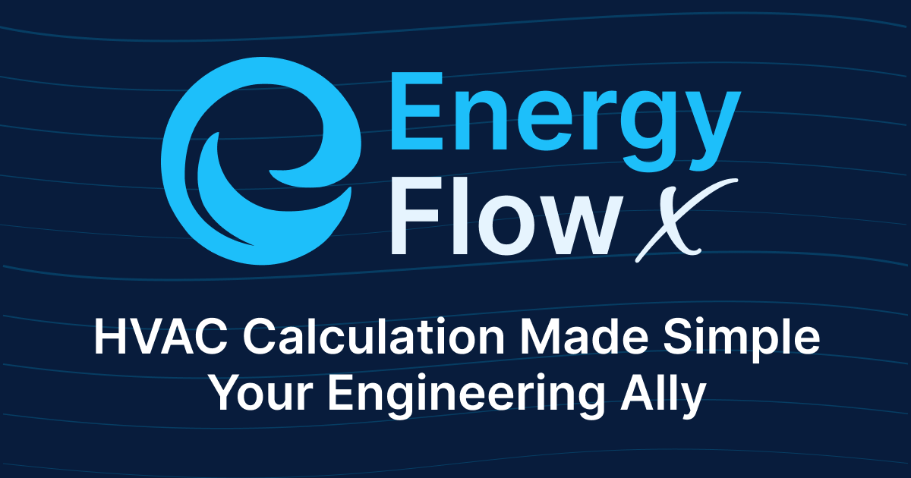
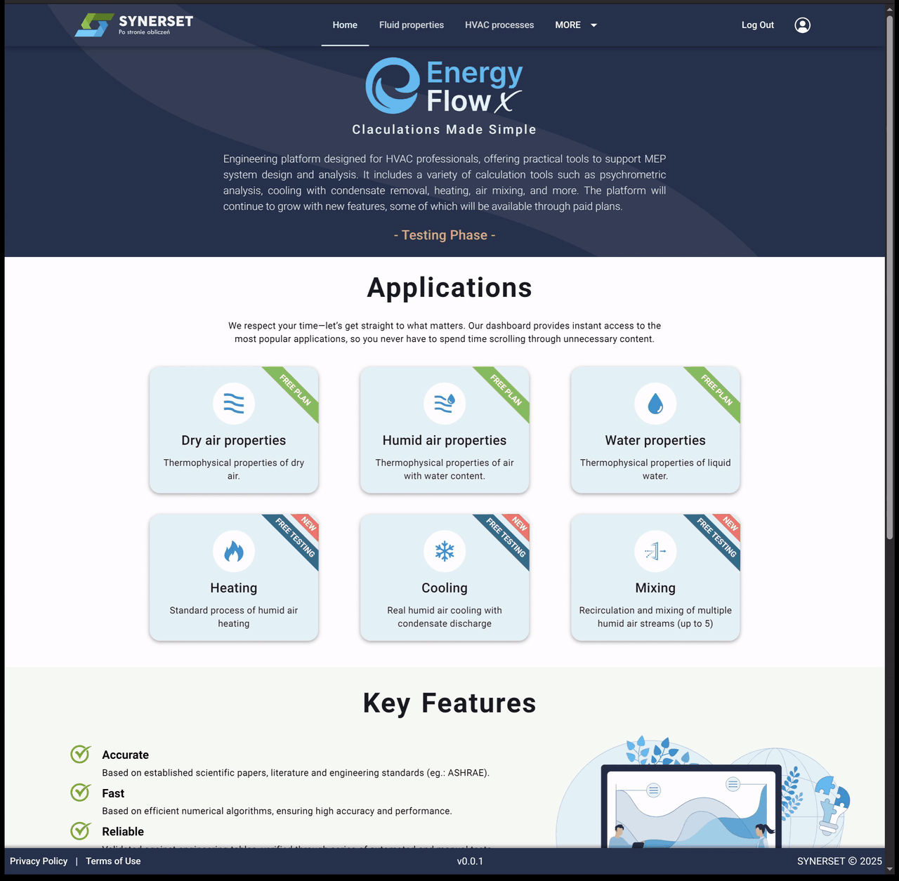
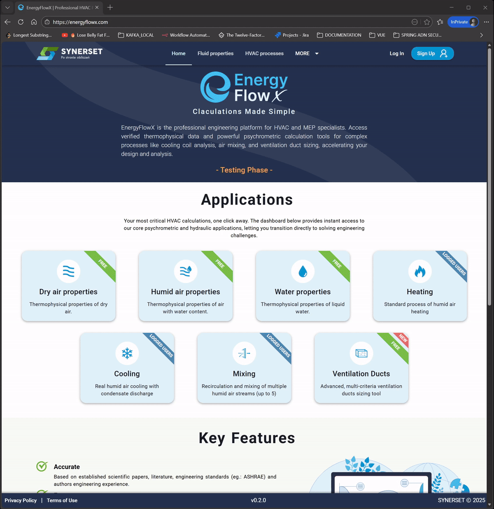
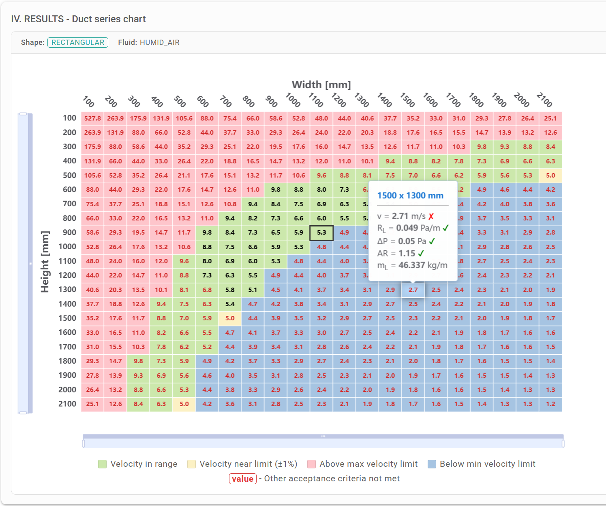

# ENERGY FLOW X (EFX) — Thermodynamics & HVAC Engineering Platform

Introducing <strong>Energy Flow X</strong>, a professional-grade web platform and REST API for thermodynamic calculations, HVAC engineering, and fluid mechanics.

| PROJECT LOGO (Copyright pending)                                       | URL's:                                                                                                           |
|------------------------------------------------------------------------|------------------------------------------------------------------------------------------------------------------|
| [](https://energyflowx.com) | ⇒ [Go to EFX Website](https://energyflowx.com) ⇐ <br><br> ⇒ [Go to EFX Demo API](https://demo.energyflowx.com) ⇐ |

EnergyFlowX is powered by a family of engineering libraries built from scratch:
- [HVAC-Engine-Pro](https://github.com/pjazdzyk/hvac-engine-pro) — Thermodynamic properties and processes: dry/humid air, water & steam (IAPWS-IF97), ice, plus HVAC process calculations (heating, cooling, mixing, heat recovery),
- [Unitility](https://github.com/pjazdzyk/unitility) — Physical quantities and units of measure conversion framework,
- [Brent-Dekker Solver](https://github.com/pjazdzyk/brent-dekker-solver) — Enhanced numerical root-finding for nested equations.

This platform serves HVAC/MEP engineers, mechanical engineers, and chemical/process engineers with precise, standards-based calculations spanning psychrometrics, steam/water thermodynamics (IAPWS-IF97), ice properties, hydraulic flow in ducts and pipes, and heat recovery systems.<br>

#### EnergyFlowX is being prepared for commercial launch following the end-user testing phase.

> This is not "_just another psychrometrics calculator_." <br>
> It is a **comprehensive engineering software ecosystem**, designed to support the development of complex engineering projects like this one. <br>
> This product is the result of **years of development, with over 10,000 hours** of personal time invested. <br>
> The frontend is merely the crowning jewel — the cherry on top. <br>

To readers unfamiliar with fluid mechanics and thermodynamics, the calculation forms may appear deceptively simple.
But **trust me** — there's nothing simple here once you look behind the curtain… <br>

No fluid parameters are assumed as constants (specific heat, density, etc.) as is common in many available tools.
Every temperature- and pressure-dependent property is calculated from first-principles equations sourced from international standards (IAPWS, ASHRAE), peer-reviewed scientific journals,
or formulas derived independently. Review the full list of reference sources at the end of this documentation.

## WEBSITE AND API

Eager to see how the project works? Visit the site below, register to create your own free
account, and explore the platform! <br>

If you are a developer interested in building your own application — check the API demo. I offer REST API as a service
so you can focus on your application's business logic instead of investing ~10,000 hours into building backbone physics libraries.
API-as-a-Service is available on an individual pricing basis. Contact me directly for details!

| CREATED BY (All rights reserved):           | DEVELOPER:                                                                                                                                                         |
|---------------------------------------------|--------------------------------------------------------------------------------------------------------------------------------------------------------------------|
|  | **Piotr Jazdzyk,** MSc Eng <br> [Read more about the author](https://energyflowx.com/social) <br> [Reach me out on LinkedIn](https://www.linkedin.com/in/pjazdzyk) |

Do not forget to say hello!

Cooling process calculation showcase:
[](https://energyflowx.com/hvac-processes/cooling)

Multiple air stream mixing process showcase:
[](https://energyflowx.com/hvac-processes/mixing)

Humid air thermophysical properties calculation showcase:
[](https://energyflowx.com/fluid-properties/humid-air)

DuctX — comprehensive ventilation duct sizing calculator:
[](https://energyflowx.com/hydraulics/duct-sizing-calculator)

**NO AI ZONE**. <br>
All calculations use hand-crafted algorithms based on established scientific formulas and equations, implemented from scratch.
I love AI, but this is not the right project for LLMs.

---

# DOCUMENTATION

1. [Tech & dependencies](#1-tech-and-dependencies)
2. [System design & architecture](#2-system-design)
3. [Functionality](#3-functionality)
4. [REST API](#4-rest-api)
   4.1 [API versioning](#41-api-versioning)
   4.2 [Physical quantities master data](#42-physical-quantities-master-data)
   4.3 [Unit conversion](#43-unit-conversion)
   4.4 [Dry air properties](#44-dry-air-properties)
   4.5 [Liquid water properties](#45-liquid-water-properties)
   4.6 [Humid air properties](#46-humid-air-properties)
   4.7 [Steam properties (IAPWS-IF97)](#47-steam-properties)
   4.8 [Ice Ih properties](#48-ice-ih-properties)
   4.9 [Property tables generation](#49-property-tables)
   4.10 [Heating process](#410-heating-process)
   4.11 [Cooling process](#411-cooling-process)
   4.12 [Mixing process](#412-mixing-process)
   4.13 [Heat recovery process](#413-heat-recovery-process)
   4.14 [Humid air flow calculations](#414-humid-air-flow-calculations)
   4.15 [Sequential process computation](#415-sequential-process-computation)
   4.16 [Unit overrides](#416-unit-overrides)
   4.17 [Hydraulic conduit](#417-hydraulic-conduit)
   4.18 [Conduit master data](#418-conduit-master-data)
   4.19 [Materials database](#419-materials-database)
   4.20 [Benchmark](#420-benchmark)
   4.21 [File download](#421-file-download)
   4.22 [Error response](#422-error-response)
   4.23 [Swagger UI](#423-swagger-ui)
5. [Licensing, attribution, and citation](#5-licensing-attribution-and-citation)
6. [Feature request and bug reporting](#6-feature-request-and-bug-reporting)
7. [Acknowledgments](#7-acknowledgments)
8. [Reference sources](#8-reference-sources)

---

## 1. TECH AND DEPENDENCIES

<strong>EnergyFlow X</strong> is built with the following technologies:

Frontend:
 &nbsp;
 &nbsp;
 &nbsp;
 &nbsp;
 &nbsp;
 &nbsp;

Backend:
 &nbsp;
 &nbsp;
 &nbsp;
 &nbsp;
 &nbsp;
 &nbsp;

Infrastructure:
 &nbsp;
 &nbsp;
 &nbsp;
 &nbsp;
 &nbsp;

Engineering libraries:
[](https://github.com/pjazdzyk/unitility) &nbsp;
[](https://github.com/pjazdzyk/brent-dekker-solver) &nbsp;
[](https://github.com/pjazdzyk/hvac-engine-pro) &nbsp;

---

## 2. SYSTEM DESIGN

EnergyFlowX is deployed as a set of microservices on an external server using Docker Swarm. Separation of Concerns is applied,
with the following independent services:

- **User manager service** — user registration, authentication, and account management,
- **Business logic service** — all thermodynamic, HVAC process, fluid properties, unit conversion, hydraulic, and materials computations,
- **Reverse proxy server** — NGINX instance serving static frontend assets and acting as a reverse proxy.

The **Backend** business-logic service follows a hexagonal (ports-and-adapters) architecture. Both user manager and business logic
services are structured as modular Maven projects with separated API and CORE modules. The API module defines port interfaces
implemented by REST controllers in the CORE infrastructure layer.

The **Frontend** is built with Vue.js and Quasar Framework in JavaScript. Custom components like `ScientificInput` handle
physical quantity values with associated units, automatic validation, and live unit conversion.
The frontend is designed to be **super lightweight and fast** — no raster images (PNG/JPG) are used; all graphics are
vector-based SVG. Pages prioritize content density and usability for engineers in daily professional use.

**Google Analytics** tracks basic page usage. **SEO** meta tags are configured for search engine visibility.

**Security** follows industry best practices:

- RBAC (role-based access control) for tiered content access,
- GDPR/ROD-compliant data handling with minimal data collection,
- HTTPS (strict mode) across all pages,
- Modern encryption algorithms for sensitive data,
- Secrets stored in an external cloud key-vault.

---

## 3. FUNCTIONALITY

### ⇒ Available application capabilities:

**Dry air properties:**
- Density, specific enthalpy, specific heat (Cp, Cv),
- Kinematic and dynamic viscosity,
- Thermal conductivity, thermal diffusivity,
- Prandtl number,
- Wide temperature/pressure range per Lemmon & Jacobsen (2000).

**Liquid water properties (IAPWS-IF97):**
- Density, specific enthalpy, specific entropy,
- Specific heat (Cp, Cv),
- Speed of sound, isothermal compressibility,
- Thermal expansion coefficient,
- Viscosity and thermal conductivity (IAPWS formulations),
- Surface tension.

**Steam / water vapor properties (IAPWS-IF97):**
- Full coverage of Regions 1–5 (compressed liquid, superheated vapor, near-critical, two-phase, high-pressure/high-temperature),
- All standard thermodynamic properties (density, enthalpy, entropy, Cp, Cv, speed of sound, etc.),
- Backward equations p(h,s), v(p,T),
- Boundary and saturation equations.

**Ice Ih properties:**
- Gibbs energy equation of state (IAPWS R10-06),
- Density, enthalpy, entropy, heat capacity,
- Compressibility, thermal expansion coefficient,
- Melting and sublimation curve pressures.

**Moist (humid) air properties:**
- Vapour saturation pressure, dew point and wet bulb temperatures,
- Relative humidity, humidity ratio (and maximum humidity ratio),
- Specific enthalpy (including water mist and ice mist components),
- Kinematic and dynamic viscosity, thermal conductivity,
- Specific heat, density, thermal diffusivity, Prandtl number,
- Enhanced fugacity calculations per IAPWS G11-15.

**Air heating:**
- For a given input heating power,
- For a target outlet air temperature,
- For a target outlet air relative humidity.

**Air cooling (with condensate discharge):**
- For a given input cooling power,
- For a target outlet temperature,
- For a target outlet relative humidity,
- Optional coolant secondary-side calculations.

**Heat recovery:**
- From a given effectiveness value,
- For a target supply temperature,
- For a target recovered power,
- Support for multiple heat recovery types (enthalpic, sensible, latent, total),
- Air-to-air and air-to-water configurations,
- Frost/defrost diagnostics, condensate tracking, leakage modeling.

**Air stream mixing:**
- Two-flow mixing with humidity content,
- Multi-flow mixing (up to 20 streams).

**Humid air flow calculations:**
- Inter-conversion between volumetric flow, mass flow, and dry-air mass flow at given state conditions.

**Hydraulic conduits — DuctX & PipeX:**
- Circular, rectangular, and elliptical cross-sections,
- Flow velocity, Reynolds number,
- Linear pressure loss and linear resistance,
- Colebrook-White friction factor (iterative numerical solution),
- Minor (local) pressure losses via loss coefficients (ζ),
- Linear mass density from construction materials and insulation layers,
- Master data database of real market duct and pipe products,
- Calculations based on real humid air properties,
- HeatMap visualization for full dimension series.

[](https://energyflowx.com/hydraulics/duct-sizing-calculator)

**Materials database:**
- Construction and insulation materials with thermal and mechanical properties,
- Hydraulic condition data (surface roughness),
- Query by material type, layer type, or application.

**Property tables generation:**
- Generate multi-parameter thermodynamic property tables,
- Configurable axes, modes, and step sizes.

### ⇒ Functionalities available in the backend (API-only):

**Sequential process computation:**
- Chain multiple process definitions (heating, cooling, mixing, heat recovery) where each process's output feeds the next,
- Simulate arbitrary air handling unit configurations,
- Bulk computation mode for multiple scenarios in a single request.

**Benchmark tool:**
- Performance benchmarking of core computation engines.

---

## 4. REST API

The REST API empowers developers to integrate thermodynamic and HVAC calculations into their own software. A free demo is available at https://demo.energyflowx.com/ with limited functionality and rate limiting. For unlimited access, contact the author for pricing.

All API paths are prefixed with `/api`. Physical quantities are specified as strings combining a numeric value and a unit symbol (e.g., `"20.5C"`, `"101325.0Pa"`). The full list of supported units is available via the `/api/quantities` endpoint.

### 4.1. API Versioning

The API is not versioned in the URL path to simplify maintenance. If versioned access is required, contact the author.

### 4.2. Physical quantities master data

Retrieve the full catalog of supported physical quantities and their units.

| # | PATH                          | METHOD | DESCRIPTION                              |
|---|-------------------------------|--------|------------------------------------------|
| 1 | `/api/quantities`             | GET    | List all physical quantity types         |
| 2 | `/api/quantities/{quantity-type}` | GET  | Get units for a specific quantity type   |

Example: [Quantities master data response](assets/json/quantities_masterdata_response.json)

### 4.3. Unit conversion

Convert physical quantities between any supported units of the same quantity type.

| # | PATH                                  | METHOD | PARAMETERS                                                    |
|---|---------------------------------------|--------|---------------------------------------------------------------|
| 1 | `/api/quantities/convert/{quantity-type}` | GET  | **quantity-type** (path), **value**, **from-unit**, **target-unit** (query) |
| 2 | `/api/quantities/convert`             | POST   | [Request body example](assets/json/multiple_quantity_conversion.json) |

Example: [Conversion response](assets/json/conversion_response.json)

### 4.4. Dry air properties

Calculate thermodynamic properties of dry air over wide temperature/pressure ranges (Lemmon & Jacobsen, 2000).

| # | PATH                    | METHOD | QUERY PARAMETERS                                                   |
|---|-------------------------|--------|--------------------------------------------------------------------|
| 1 | `/api/properties/dry-air` | GET   | **temperature**, pressure (default: 101325.0Pa), imperial-units, unit-overrides |

### 4.5. Liquid water properties

Calculate properties of liquid water per IAPWS-IF97 Region 1 and IAPWS transport property formulations.

| # | PATH                       | METHOD | QUERY PARAMETERS                                                   |
|---|----------------------------|--------|--------------------------------------------------------------------|
| 1 | `/api/properties/liquid-water` | GET  | **temperature**, **pressure**, imperial-units, unit-overrides      |

### 4.6. Humid air properties

Six entry modes to compute humid air state from different input combinations.

| # | PATH                                      | METHOD | REQUIRED QUERY PARAMETERS                              |
|---|-------------------------------------------|--------|--------------------------------------------------------|
| 1 | `/api/properties/humid-air`               | GET    | **temperature**, (+ humidity-ratio OR relative-humidity) |
| 2 | `/api/properties/humid-air/from-wet-bulb` | GET    | **wet-bulb-temperature**, (+ relative-humidity OR humidity-ratio) |
| 3 | `/api/properties/humid-air/from-dew-point`| GET    | **dew-point-temperature**, **relative-humidity**         |
| 4 | `/api/properties/humid-air/from-enthalpy` | GET    | **specific-enthalpy**, **humidity-ratio**                |
| 5 | `/api/properties/humid-air/from-humidity` | GET    | **humidity-ratio**, **relative-humidity**                |

All endpoints also accept optional: pressure (default: 101325.0Pa), imperial-units, unit-overrides.

Example: [Humid air response](assets/json/humid_air_response.json)

### 4.7. Steam properties

Full IAPWS-IF97 steam/water properties across all five regions, with multiple entry modes.

| # | PATH                                  | METHOD | REQUIRED QUERY PARAMETERS                       |
|---|---------------------------------------|--------|-------------------------------------------------|
| 1 | `/api/properties/steam`               | GET    | **temperature**, **pressure**                   |
| 2 | `/api/properties/steam/from-enthalpy` | GET    | **specific-enthalpy**, **pressure**             |
| 3 | `/api/properties/steam/from-entropy`  | GET    | **specific-entropy**, **pressure**              |
| 4 | `/api/properties/steam/from-mollier`  | GET    | **specific-enthalpy**, **specific-entropy**     |

All endpoints also accept optional: imperial-units, unit-overrides.

### 4.8. Ice Ih properties

Thermodynamic properties of ice (Ice Ih phase) per IAPWS R10-06 equation of state.

| # | PATH                 | METHOD | QUERY PARAMETERS                                      |
|---|----------------------|--------|-------------------------------------------------------|
| 1 | `/api/properties/ice` | GET   | **temperature**, **pressure**, imperial-units, unit-overrides |

### 4.9. Property tables

Generate tabulated thermodynamic property data for reporting or further analysis.

| # | PATH                          | METHOD | DESCRIPTION                                  |
|---|-------------------------------|--------|----------------------------------------------|
| 1 | `/api/properties/table`       | POST   | Generate a property table (request body)     |
| 2 | `/api/properties/table/modes` | GET    | List available table generation modes        |
| 3 | `/api/properties/table/modes/{mode}` | GET | Get parameters for a specific mode |

### 4.10. Heating process

Heat a humid air stream in one of three modes.

| # | PATH                                           | METHOD | REQUEST BODY EXAMPLE                                          |
|---|------------------------------------------------|--------|---------------------------------------------------------------|
| 1 | `/api/processes/heating/target-input-power`    | POST   | [Request body](assets/json/heating_req_input_power.json)      |
| 2 | `/api/processes/heating/target-temperature`    | POST   | [Request body](assets/json/heating_req_target_temp.json)      |
| 3 | `/api/processes/heating/target-relative-humidity` | POST | [Request body](assets/json/heating_req_target_RH.json)    |

Query params: imperial-units, unit-overrides.
Example: [Heating response](assets/json/heating_response_temperature.json)

### 4.11. Cooling process

Cool a humid air stream with condensate discharge in one of three modes. Optional coolant (secondary) side.

| # | PATH                                           | METHOD | REQUEST BODY EXAMPLE                                          |
|---|------------------------------------------------|--------|---------------------------------------------------------------|
| 1 | `/api/processes/cooling/target-input-power`    | POST   | [Request body](assets/json/cooling_req_input_power.json)      |
| 2 | `/api/processes/cooling/target-temperature`    | POST   | [Request body](assets/json/cooling_req_target_temp.json)      |
| 3 | `/api/processes/cooling/target-relative-humidity` | POST | [Request body](assets/json/cooling_req_target_RH.json)    |

Query params: imperial-units, unit-overrides.
Example: [Cooling response](assets/json/cooling_response_temperature.json)

### 4.12. Mixing process

Mix two or more humid air streams.

| # | PATH                           | METHOD | REQUEST BODY EXAMPLE                               |
|---|--------------------------------|--------|----------------------------------------------------|
| 1 | `/api/processes/mixing`        | POST   | [Request body](assets/json/mixing_request.json)    |
| 2 | `/api/processes/mixing/multiple` | POST | [Request body](assets/json/mixing_request.json)    |

Query params: imperial-units, unit-overrides.
Example: [Mixing response](assets/json/mixing_response.json)

### 4.13. Heat recovery process

Compute heat recovery between supply and exhaust air streams with frost/defrost diagnostics, condensate tracking, and leakage modeling.

| # | PATH                                                | METHOD | DESCRIPTION                           |
|---|-----------------------------------------------------|--------|---------------------------------------|
| 1 | `/api/processes/heat-recovery/from-effectiveness`   | POST   | Given heat recovery effectiveness     |
| 2 | `/api/processes/heat-recovery/target-supply-temperature` | POST | Target supply outlet temperature |
| 3 | `/api/processes/heat-recovery/target-recovered-power` | POST  | Target recovered thermal power      |

Supports enthalpic, sensible, latent, and total heat recovery types. Air-to-air and air-to-water configurations. Defrost strategy configuration.

Query params: imperial-units, unit-overrides.

### 4.14. Humid air flow calculations

Inter-convert volumetric flow, mass flow, and dry-air mass flow at specified state conditions.

| # | PATH                     | METHOD | REQUEST BODY EXAMPLE                                  |
|---|--------------------------|--------|-------------------------------------------------------|
| 1 | `/api/flows/humid-air`   | POST   | [Request body](assets/json/humid_air_flow_request.json) |

Example: [Flow response](assets/json/humid_air_flow_response.json)

### 4.15. Sequential process computation

Chain multiple HVAC processes where each process's output feeds the next input. Simulate arbitrary air handling unit configurations. Bulk mode supports multiple independent scenario chains in one request.

| # | PATH                             | METHOD | REQUEST BODY EXAMPLE                                   |
|---|----------------------------------|--------|--------------------------------------------------------|
| 1 | `/api/procedures/sequential`     | POST   | [Request body](assets/json/sequential_request.json)    |

Example: [Sequential response](assets/json/sequential_response.json)

Query params: imperial-units, unit-overrides.

### 4.16. Unit overrides

All endpoints that return physical quantities support unit overrides to customize the output units:

**In request body (POST):**
```json
{
  "unitOverrides": {
    "pressure": "kPa",
    "temperature": "K",
    "volumetricFlow": "m3/min"
  }
}
```

**As query parameter (GET):**
```
?unit-overrides=pressure_kPa,temperature_K,volumetricFlow_m3%2Fmin
```

Retrieve the full list of supported quantity types and unit symbols from `/api/quantities`.

### 4.17. Hydraulic conduit

Calculate flow characteristics for conduits (ducts and pipes) with circular, rectangular, or elliptical cross-sections.

| # | PATH                              | METHOD | REQUEST BODY EXAMPLE                               |
|---|-----------------------------------|--------|----------------------------------------------------|
| 1 | `/api/hydraulics/single-flow-mode` | POST   | [Request body](assets/json/conduit_request.json)   |

Computes flow velocity, Reynolds number, friction factor (Colebrook-White), linear and local pressure losses, and structural mass.

Example: [Conduit response](assets/json/conduit_response.json)

### 4.18. Conduit master data

Access databases of standard duct and pipe dimensions from real manufacturers, filtered by application, pressure class, leakage class, and material.

| # | PATH                                      | METHOD | DESCRIPTION                                     |
|---|-------------------------------------------|--------|-------------------------------------------------|
| 1 | `/api/conduits/ducts/{ductCode}`          | GET    | Get duct master data by product code            |
| 2 | `/api/conduits/pipes/{pipeCode}`          | GET    | Get pipe master data by product code            |
| 3 | `/api/conduits/ducts/query`               | POST   | Query ducts by filter criteria                  |
| 4 | `/api/conduits/pipes/query`               | POST   | Query pipes by filter criteria                  |
| 5 | `/api/conduits/ducts/value-help/query`    | POST   | Lightweight value-help lookup for ducts         |
| 6 | `/api/conduits/pipes/value-help/query`    | POST   | Lightweight value-help lookup for pipes         |

### 4.19. Materials database

Query construction and insulation materials with thermal, mechanical, and hydraulic properties.

| # | PATH                  | METHOD | DESCRIPTION                          |
|---|-----------------------|--------|--------------------------------------|
| 1 | `/api/materials`      | POST   | Query materials by filter criteria   |

Returns material properties, layer types, hydraulic roughness data, and thermal conductivity.

### 4.20. Benchmark

Run performance benchmarks on the core computation engines.

| # | PATH                   | METHOD | DESCRIPTION                       |
|---|------------------------|--------|-----------------------------------|
| 1 | `/api/benchmark/run`   | GET    | Execute a benchmark run           |

Returns timing data, throughput metrics, and per-engine summaries.

### 4.21. File download

Download reference documents and resources.

| # | PATH                                       | METHOD | DESCRIPTION                       |
|---|--------------------------------------------|--------|-----------------------------------|
| 1 | `/api/resources/documents/{fileType}/{fileCode}` | GET  | Download a reference document |

### 4.22. Error response

Validation errors and domain exceptions return HTTP 400 (Bad Request) with a structured response:

```json
{
  "serviceName": "Energy Flow X",
  "cause": "UnitSystemParseException",
  "message": "Unsupported unit symbol: {xyz}. Target class: TemperatureUnits",
  "timestamp": "2024-02-10T14:39:11.8551038Z"
}
```

Internal stack traces are never exposed. Report any leaks immediately via the issue tracker.

### 4.23. Swagger UI

Interactive API documentation and testing is available at: https://demo.energyflowx.com

---

## 5. LICENSING, ATTRIBUTION, AND CITATION

Any reference to this project must include proper attribution to the author. While code samples may be shared publicly for educational purposes, the project as a whole is designated for commercial use under the author's terms. Unauthorized commercial use is strictly prohibited. All rights reserved by the author.

---

## 6. FEATURE REQUEST AND BUG REPORTING

Feedback and ideas are welcome. This project was built by an engineer, for engineers — I want it to be as useful as possible in your daily work. Submit bugs and feature requests on the [GitHub Issues](https://github.com/pjazdzyk/energy-flow-x-demo/issues) page.

### Help me improve by reporting bugs:

Include the following in your report:

- **Page or Functionality** — where the issue occurred,
- **Description** — clear and detailed account of the bug,
- **Input Data** — values/inputs used when the bug triggered,
- **Result and Expectation** — what happened vs. what you expected,
- **App Version** — found at the bottom of the application.

**Your feedback is the fuel that drives this project forward.**
Every suggestion and bug report makes this tool better — thank you for being part of the process!

---

## 7. ACKNOWLEDGMENTS

I want to thank [Mabas83](https://github.com/mabas83), for everything you did for me. <br>
Heartfelt gratitude to the [Silesian University of Technology](https://www.polsl.pl/en/) for the knowledge, scientific guidance, and for shaping me into an engineer.<br>
Special thanks to [GreedyJ4ck](https://github.com/greedyj4ck) for discussions and valuable suggestions during frontend development. BIG THANKS!

---

## 8. REFERENCE SOURCES

### Water & Steam (Liquid / Vapor) — IAPWS Formulations

- **[1]** IAPWS R7-97(2012) — *Industrial Formulation for the Thermodynamic Properties of Water and Steam (IF97)*. Covers Regions 1–5, boundary equations, backward equations, and uncertainty estimates. Valid up to 100 MPa, 273.15 K–1073.15 K (Region 1), up to 80 MPa, 863.15 K–1073.15 K (Region 2).
- **[2]** IAPWS G5-01(2020) — *Fundamental Constants*. CODATA 2018 constants, ITS-90 scale, VSMOW isotopic composition, critical and triple-point values.
- **[3]** IAPWS SR2-01(2014) — *Revised Supplementary Release on Backward Equations p(h,s) for Regions 1 and 2*.
- **[4]** IAPWS SR4-04(2014) — *Revised Supplementary Release on Backward Equations p(h,s) for Region 3, Boundary Equations, Tsat(h,s) for Region 4*.
- **[5]** IAPWS SR5-05(2016) — *Revised Supplementary Release on Backward Equations v(p,T) for Region 3*. 26 subregions plus auxiliary equations near the critical point.
- **[6]** IAPWS R6-95(2018) — *Revised Release on IAPWS-95 Formulation*. Fundamental Helmholtz free energy equation, ideal-gas and residual parts.

### Transport Properties — IAPWS

- **[7]** IAPWS R12-08(2008) — *Formulation 2008 for Viscosity of Ordinary Water Substance*.
- **[8]** IAPWS R15-11(2011) — *Formulation 2011 for Thermal Conductivity of Ordinary Water Substance*.
- **[9]** IAPWS R1-76(2014) — *Revised Release on Surface Tension of Ordinary Water Substance*.

### Ice Ih (Solid Phase) — IAPWS

- **[10]** IAPWS R10-06(2009) — *Revised Release on Equation of State 2006 for H₂O Ice Ih*. Gibbs energy EOS, T ∈ [0 K, 273.16 K], p ∈ [0 Pa, 210 MPa].
- **[11]** IAPWS R14-08(2011) — *Revised Release on Pressure along Melting and Sublimation Curves*. Melting pressure for ice phases Ih, III, V, VI, VII; sublimation pressure for T ∈ [50 K, 273.16 K].

### Dry Air

- **[12]** Lemmon E.W., Jacobsen R.T., Penoncello S.G., Friend D.G. (2000) — *Thermodynamic Properties of Air and Mixtures of N₂, Ar, and O₂ from 60 to 2000 K at Pressures to 2000 MPa*. J. Phys. Chem. Ref. Data, Vol. 29, No. 3, p. 331.
- **[13]** Lemmon E.W., Jacobsen R.T. (2004) — *Viscosity and Thermal Conductivity Equations for N₂, Ar, O₂, and Air*. J. Phys. Chem. Ref. Data, Vol. 33, No. 1, p. 309.

### Humid Air — IAPWS

- **[14]** IAPWS G11-15(2015) — *Guideline on Virial Equation for Fugacity of H₂O in Humid Air*.
- **[15]** IAPWS G9-12(2012) — *Guideline on Low-Temperature Extension of IAPWS-95 for Water Vapor* (50 K–130 K).

### Hydraulics (Duct / Pipe Flow)

- **[HYD-1]** Lotfi Z., Loup J., Aouine B. (2019) — *Explicit solutions for turbulent flow friction factor: A review, assessment and approaches classification*. Ain Shams Engineering Journal, 10(4), 241–254. Includes Vatankhah (2014) approximation used for initial guess in the Colebrook-White solver.
- **[HYD-2]** Mitosek M. (2001) — *Mechanika płynów w inżynierii i ochronie środowiska*. Polskie Wydawnictwo Naukowe PWN. Reynolds number, Darcy-Weisbach, minor losses, hydraulic diameter.
- **[HYD-3]** Barnard R.W., Pearce K., Schovanec L. (2001) — *Inequalities for the Perimeter of an Ellipse*. Texas Tech University. Jacobsen (1985) rational approximation for ellipse perimeter.

---
