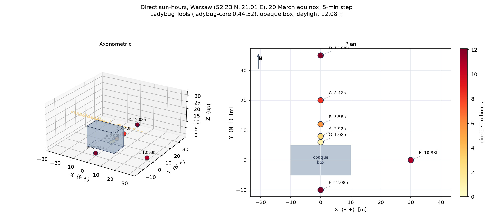
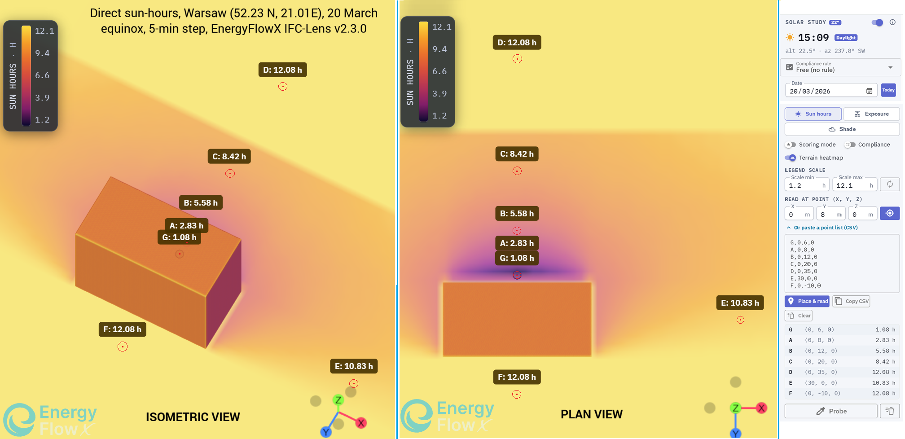

# IFC Lens, Solar module validation evidence

This folder holds a reproducible validation of the **EnergyFlowX IFC Lens Solar tool**. It
documents how the tool computes direct sun hours, and shows that the result lands in the same
place as an independent, recognized reference (Ladybug Tools) on a controlled scene that anyone
can rebuild.

The intent is simple. You should be able to take the files here, run the same check yourself,
and confirm the numbers, rather than take our word for it.

---

## 1. What is being validated

The IFC Lens Solar tool answers a geometric question: for a given location, date and building
geometry, how many hours of direct sun does a point receive over the day. It is a comparative
siting and overshadowing aid. It does not compute irradiance, energy yield or daylight factor.

We validate it on three independent legs, each against a recognized method or source:

1. **Solar position.** Where the sun is in the sky (altitude and azimuth) through the day. The
   tool uses the NOAA solar position algorithm (Meeus, *Astronomical Algorithms*). This is
   cross checked against NREL SPA reference values and an independent VSOP87 ephemeris inside
   the live in app Validation report.
2. **Occlusion.** Whether building geometry blocks the ray from a point to the sun. The tool
   uses ray traced shadowing (Moller Trumbore ray triangle intersection), checked against a
   closed form analytic shadow (the gnomon relation) in the unit tests.
3. **End to end sun hours.** The two legs combined, counting lit time samples over the day.
   This is the comparison documented in this folder, against Ladybug Tools.

Ladybug Tools is an open source, widely used and respected solar analysis library in the AEC
community. Its sun engine is built on NREL Sunpath. Comparing against it is a cross check
between two genuinely independent implementations of the same accepted physics. We are not
trying to be identical to Ladybug. We are showing that our independent methodology produces the
same answer to within the spread expected of two valid implementations.

---

## 2. The test scene

A single opaque rectangular box on flat ground. A box has a shadow you can reason about by hand,
and it removes every confound (glazing, messy geometry, sensor auto placement).

| Property | Value |
| --- | --- |
| Box footprint | X from -10 to +10 m, Y from -5 to +5 m (20 by 10 m) |
| Box height | 15 m (Z from 0 to 15) |
| Long axis | east to west |
| Location | Warsaw, 52.23 N, 21.01 E |
| Date | 20 March (equinox, a clean east to west shadow sweep, about 12 h of day) |
| Period | whole day, sunrise to sunset |
| Time step | 5 minutes |
| Orientation | building north is true north, bearing 0, true north is +Y |

Coordinates are in metres, +X east, +Y north, +Z up. The IFC carries the location on its
`IfcSite` (latitude, longitude, true north), so IFC Lens reads the site straight from the file.

Sun hours are read at seven ground points, chosen to span deep shadow to full open sky:

| Point | Position (x, y, z) m | What it tests |
| --- | --- | --- |
| G | (0, 6, 0) | 1 m north of the face, deepest shade |
| A | (0, 8, 0) | 3 m north, the shadow edge (the most sensitive point) |
| B | (0, 12, 0) | 7 m north, shaded midday, lit mornings and evenings |
| C | (0, 20, 0) | 15 m north, near the noon shadow tip |
| D | (0, 35, 0) | 30 m north, open sky |
| E | (30, 0, 0) | 25 m east, open most of the day |
| F | (0, -10, 0) | south side, the sun is in the south, fully open |

The same seven points are in `scene/solar-test-points.csv`, ready to paste into the IFC Lens
"Read at point" list.

---

## 3. Result

Both tools at a 5 minute step on 20 March in Warsaw. Daylight total 12.08 h on both sides.

| Point | Position (x, y, z) m | IFC Lens (h) | Ladybug (h) | Difference (h) |
| --- | --- | --- | --- | --- |
| G | (0, 6, 0) | 1.08 | 1.08 | 0.00 |
| A | (0, 8, 0) | 2.83 | 2.92 | -0.09 |
| B | (0, 12, 0) | 5.58 | 5.58 | 0.00 |
| C | (0, 20, 0) | 8.42 | 8.42 | 0.00 |
| D | (0, 35, 0) | 12.08 | 12.08 | 0.00 |
| E | (30, 0, 0) | 10.83 | 10.83 | 0.00 |
| F | (0, -10, 0) | 12.08 | 12.08 | 0.00 |

Six of seven points are identical. The seventh, point A, differs by 0.09 h, which is a single 5
minute step (one sample is 0.083 h).

**Why A and only A.** A sits right on the moving shadow edge. Whether one particular 5 minute
sample lands on the lit or the shaded side of that edge is decided by the sun position to a
fraction of a degree. IFC Lens uses the NOAA solar equations, Ladybug uses NREL SPA. They differ
by about 0.01 degrees, enough to flip A's one boundary sample, and nothing else (the other six
points are either fully open or deeply shaded, so a few seconds never flips them). The residual
is therefore the expected sampling and algorithm spread of two valid tools, not an error. A 1
minute step shrinks it further. EnergyFlowX's own independent ray box calculation also gives A =
2.83 h, which confirms the IFC Lens number is internally consistent and that the gap is purely
the two sun position algorithms.

### Figures

Ladybug Tools, computed and rendered from the ladybug-core Python library:



EnergyFlowX IFC Lens, the live in browser tool on the same scene:



---

## 4. Reproduce it yourself

### A. The reference (Ladybug Tools), no Rhino needed

Ladybug Tools is a Python library under the hood. You can run the reference without Rhino or
Grasshopper at all.

```bash
python -m venv .venv
# Windows:  .venv\Scripts\activate
# macOS/Linux:  source .venv/bin/activate
pip install -r scripts/requirements.txt

python scripts/ladybug_reference.py     # prints the reference sun hours at the 7 points
python scripts/lb_evidence_figure.py    # renders figures/ladybug-direct-sun-hours.png
```

`ladybug_reference.py` uses the Ladybug `Sunpath` engine for the sun positions (the same NREL
based engine the Grasshopper "Direct Sun Hours" component uses) and a ray versus axis aligned
box test for the occlusion.

If you prefer the full visual Grasshopper route, the protocol in
`ladybug-comparison-protocol.md` (in the EnergyFlowX repository) lists the exact component graph.
Either route gives the same numbers.

### B. EnergyFlowX IFC Lens, in your browser

1. Open the IFC Lens at <https://energyflowx.com/cae-bim/ifc-lens>.
2. Load `scene/solar-test-box.ifc`. The location reads from the file automatically.
3. Open the **Solar** tool. Set the date to **20 March**, the period to the whole day, and both
   the ground step and building step to **5 min**. Run the simulation.
4. Open **"Or paste a point list (CSV)"** and paste the seven lines from
   `scene/solar-test-points.csv` (or just `x, y, z` per line). Press **Place and read**.
5. The table lists the sun hours at each point. They will match the table above.

### C. Rebuild the IFC scene from scratch (optional)

```bash
python scripts/generate_box_ifc.py      # writes solar-test-box.ifc
```

This writes the exact georeferenced box with `ifcopenshell`, so you can confirm the geometry and
the site location are nothing more than what is described here.

---

## 5. Files in this folder

```
solar_module/
  README.md                     this document
  figures/
    ladybug-direct-sun-hours.png    Ladybug Tools result (reference)
    ifc-lens-direct-sun-hours.png   EnergyFlowX IFC Lens result
  scene/
    solar-test-box.ifc              the test scene (box on flat ground, Warsaw site)
    solar-test-points.csv           the 7 read points, paste ready
  scripts/
    requirements.txt                Python dependencies
    ladybug_reference.py            reference sun hours from the Ladybug library
    lb_evidence_figure.py           renders the Ladybug figure
    generate_box_ifc.py             rebuilds the test IFC
```

---

## 6. Licensing and attribution

The reference figures and numbers are computed by the scripts in this folder from the
**Ladybug Tools** open source Python library (`ladybug-core`), which is itself based on NREL
Sunpath. Ladybug Tools is named here for nominative reference only. Nothing of its source,
user interface, data or documentation is reproduced. The numerical agreement reflects correct
shared physics, not copied content.

- **Ladybug Tools** <https://www.ladybug.tools> (open source).
- **NREL Solar Position Algorithm**, Reda I. and Andreas A. (2004), *Solar Energy* 76(5),
  577 to 589.
- **NOAA solar position equations**, after Meeus J., *Astronomical Algorithms*.

EnergyFlowX, the IFC Lens and the Solar tool are the property of Synerset. See the repository
root for the full license and citation terms.
</content>
